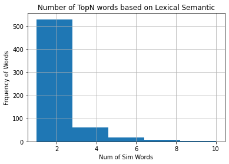
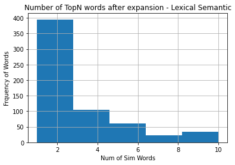
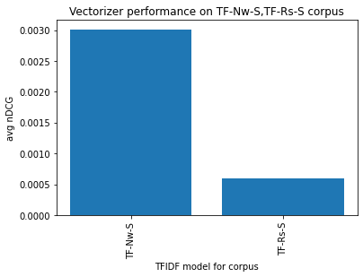
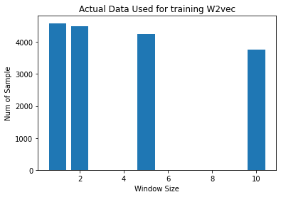
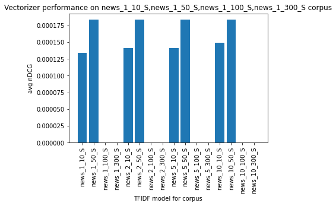
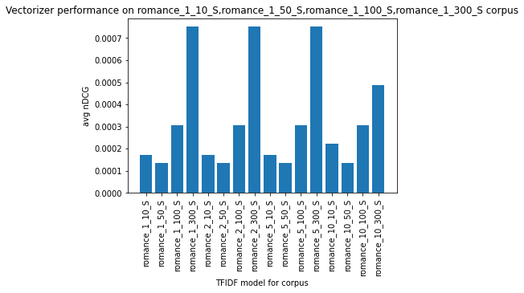
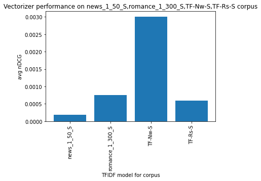

[Open in Colab](https://colab.research.google.com/github/mayankkom-dev/NLU_Assignment3/blob/main/COMP8730_Assign03_kumar48.ipynb)</p>
Semantics is the study of the meaning of words. In Natural Language Modelling (NLM), the semantics of words can be explained using two approaches, namely i) lexical semantics determined manually by linguistics and ii) vector semantics that is based on the idea of distributional semantics. In our work, for simplicity, we argue that lexical semantics are the golden standard about the semantics of the words based on which we evaluate the results of vector semantics methods - TFiDF, Word2vec using nDCG as our metric. 

# Setup environmnet - Colab 

```python
!pip install pytrec_eval
```

    Requirement already satisfied: pytrec_eval in /usr/local/lib/python3.7/dist-packages (0.5)


# Downloading Dataset


```python
from custom_download import download_df
df = download_df(url="https://fh295.github.io/SimLex-999.zip")
df.head(3)
```


<div>
<table border="1" class="dataframe">
  <thead>
    <tr style="text-align: right;">
      <th></th>
      <th>word1</th>
      <th>word2</th>
      <th>POS</th>
      <th>SimLex999</th>
      <th>conc(w1)</th>
      <th>conc(w2)</th>
      <th>concQ</th>
      <th>Assoc(USF)</th>
      <th>SimAssoc333</th>
      <th>SD(SimLex)</th>
    </tr>
  </thead>
  <tbody>
    <tr>
      <th>0</th>
      <td>old</td>
      <td>new</td>
      <td>A</td>
      <td>1.58</td>
      <td>2.72</td>
      <td>2.81</td>
      <td>2</td>
      <td>7.25</td>
      <td>1</td>
      <td>0.41</td>
    </tr>
    <tr>
      <th>1</th>
      <td>smart</td>
      <td>intelligent</td>
      <td>A</td>
      <td>9.20</td>
      <td>1.75</td>
      <td>2.46</td>
      <td>1</td>
      <td>7.11</td>
      <td>1</td>
      <td>0.67</td>
    </tr>
    <tr>
      <th>2</th>
      <td>hard</td>
      <td>difficult</td>
      <td>A</td>
      <td>8.77</td>
      <td>3.76</td>
      <td>2.21</td>
      <td>2</td>
      <td>5.94</td>
      <td>1</td>
      <td>1.19</td>
    </tr>
  </tbody>
</table>
</div>


# Golden Standard


```python
df.groupby('word1').get_group('apple').head(3)
```


<div>
<table border="1" class="dataframe">
  <thead>
    <tr style="text-align: right;">
      <th></th>
      <th>word1</th>
      <th>word2</th>
      <th>POS</th>
      <th>SimLex999</th>
      <th>conc(w1)</th>
      <th>conc(w2)</th>
      <th>concQ</th>
      <th>Assoc(USF)</th>
      <th>SimAssoc333</th>
      <th>SD(SimLex)</th>
    </tr>
  </thead>
  <tbody>
    <tr>
      <th>280</th>
      <td>apple</td>
      <td>juice</td>
      <td>N</td>
      <td>2.88</td>
      <td>5.0</td>
      <td>4.89</td>
      <td>4</td>
      <td>0.70</td>
      <td>1</td>
      <td>1.65</td>
    </tr>
    <tr>
      <th>389</th>
      <td>apple</td>
      <td>candy</td>
      <td>N</td>
      <td>2.08</td>
      <td>5.0</td>
      <td>4.83</td>
      <td>4</td>
      <td>0.35</td>
      <td>0</td>
      <td>0.75</td>
    </tr>
    <tr>
      <th>637</th>
      <td>apple</td>
      <td>sauce</td>
      <td>N</td>
      <td>1.43</td>
      <td>5.0</td>
      <td>4.75</td>
      <td>4</td>
      <td>0.14</td>
      <td>0</td>
      <td>2.11</td>
    </tr>
  </tbody>
</table>
</div>


```python
from groupby_topN import get_topNDf, pretty_plotHist, transitivityExp
top_n_df = get_topNDf(df)
top_n_df.head(3)
```

    Total 616 unique word for our Golden Standard


<div>
<table border="1" class="dataframe">
  <thead>
    <tr style="text-align: right;">
      <th></th>
      <th>word1</th>
      <th>topN</th>
      <th>topNW</th>
    </tr>
  </thead>
  <tbody>
    <tr>
      <th>0</th>
      <td>absence</td>
      <td>1</td>
      <td>presence</td>
    </tr>
    <tr>
      <th>1</th>
      <td>absorb</td>
      <td>3</td>
      <td>learn, possess, withdraw</td>
    </tr>
    <tr>
      <th>2</th>
      <td>abundance</td>
      <td>1</td>
      <td>plenty</td>
    </tr>
  </tbody>
</table>
</div>


```python
pretty_plotHist(top_n_df, 'topN', 5, title='Number of TopN words based on Lexical Semantic',
xlabel='Num of Sim Words', ylabel='Frquency of Words')
```





# Expanding Golden Standard - Trasitivity


```python
# Before expansion
top_n_df[top_n_df['word1']=='learn']
```


<div>

<table border="1" class="dataframe">
  <thead>
    <tr style="text-align: right;">
      <th></th>
      <th>word1</th>
      <th>topN</th>
      <th>topNW</th>
    </tr>
  </thead>
  <tbody>
    <tr>
      <th>358</th>
      <td>learn</td>
      <td>2</td>
      <td>listen, evaluate</td>
    </tr>
  </tbody>
</table>
</div>


```python
top_n_df = transitivityExp(top_n_df, df)
# After expansion
top_n_df[top_n_df['word1']=='learn']
```


<div>

<table border="1" class="dataframe">
  <thead>
    <tr style="text-align: right;">
      <th></th>
      <th>word1</th>
      <th>topN</th>
      <th>topNW</th>
      <th>topN_</th>
      <th>topNW_</th>
    </tr>
  </thead>
  <tbody>
    <tr>
      <th>358</th>
      <td>learn</td>
      <td>2</td>
      <td>listen, evaluate</td>
      <td>4</td>
      <td>listen,  evaluate, hear,  obey</td>
    </tr>
  </tbody>
</table>
</div>


```python
pretty_plotHist(top_n_df, 'topN_', 5, title='Number of TopN words after expansion - Lexical Semantic',
xlabel='Num of Sim Words', ylabel='Frquency of Words')
```





# Baseline - TFiDF Vectorizer - News, Romance

### Training Vectorizer


```python
from tfidf_vec import fitBrown_tfidfvect, find_topN, topN_TFiDF
vectBrown_news, vectFitBrown_news  = fitBrown_tfidfvect(corpus_cat="news")
vectBrown_romance, vectFitBrown_romance  = fitBrown_tfidfvect(corpus_cat="romance")
```

    [nltk_data] Downloading package brown to /root/nltk_data...
    [nltk_data]   Package brown is already up-to-date!


```python
# find top10 using cosine similarity and the trained tfidf vectorizer
find_topN('world', vectBrown_news, vectFitBrown_news)
```


    ('free, war, series, mad, did, greatest, sure, single, coal',
     [('free', 0.7401663764137629),
      ('war', 0.6826088407452374),
      ('series', 0.6271689134895849),
      ('mad', 0.4850183223022188),
      ('did', 0.4281407864150115),
      ('greatest', 0.3853187945124261),
      ('sure', 0.3551096076423225),
      ('single', 0.32918256342375957),
      ('coal', 0.3181299040914047)])


### Generating TopN over Golden Standard


```python
# Generate top10 similar word for each word in Golden Corpus within df
# using News corpus trained
import pandas as pd
pd.set_option("display.max_columns", 100)
top_n_df = topN_TFiDF(top_n_df, vectBrown_news, vectFitBrown_news, suffix='Nw')
top_n_df.tail(3)
```


<div>

<table border="1" class="dataframe">
  <thead>
    <tr style="text-align: right;">
      <th></th>
      <th>word1</th>
      <th>topN</th>
      <th>topNW</th>
      <th>topN_</th>
      <th>topNW_</th>
      <th>topN-TF-Nw</th>
      <th>topN-TF-Nw-S</th>
    </tr>
  </thead>
  <tbody>
    <tr>
      <th>613</th>
      <td>worker</td>
      <td>3</td>
      <td>employer, mechanic, camera</td>
      <td>5</td>
      <td>employer,  mechanic,  camera, employee, president</td>
      <td></td>
      <td></td>
    </tr>
    <tr>
      <th>614</th>
      <td>world</td>
      <td>1</td>
      <td>globe</td>
      <td>1</td>
      <td>globe</td>
      <td>free, war, series, mad, did, greatest, sure, s...</td>
      <td>[(free, 0.7401663764137629), (war, 0.682608840...</td>
    </tr>
    <tr>
      <th>615</th>
      <td>yard</td>
      <td>1</td>
      <td>inch</td>
      <td>1</td>
      <td>inch</td>
      <td></td>
      <td></td>
    </tr>
  </tbody>
</table>
</div>


```python
# using Romance corpus trained
top_n_df = topN_TFiDF(top_n_df, vectBrown_romance, vectFitBrown_romance, suffix='Rs')
top_n_df.tail(3)
```


<div>

<table border="1" class="dataframe">
  <thead>
    <tr style="text-align: right;">
      <th></th>
      <th>word1</th>
      <th>topN</th>
      <th>topNW</th>
      <th>topN_</th>
      <th>topNW_</th>
      <th>topN-TF-Nw</th>
      <th>topN-TF-Nw-S</th>
      <th>topN-TF-Rs</th>
      <th>topN-TF-Rs-S</th>
    </tr>
  </thead>
  <tbody>
    <tr>
      <th>613</th>
      <td>worker</td>
      <td>3</td>
      <td>employer, mechanic, camera</td>
      <td>5</td>
      <td>employer,  mechanic,  camera, employee, president</td>
      <td></td>
      <td></td>
      <td></td>
      <td></td>
    </tr>
    <tr>
      <th>614</th>
      <td>world</td>
      <td>1</td>
      <td>globe</td>
      <td>1</td>
      <td>globe</td>
      <td>free, war, series, mad, did, greatest, sure, s...</td>
      <td>[(free, 0.7401663764137629), (war, 0.682608840...</td>
      <td>come, tough, thought, youre, damn, fashion, wo...</td>
      <td>[(come, 0.6307550123065628), (tough, 0.6228660...</td>
    </tr>
    <tr>
      <th>615</th>
      <td>yard</td>
      <td>1</td>
      <td>inch</td>
      <td>1</td>
      <td>inch</td>
      <td></td>
      <td></td>
      <td></td>
      <td></td>
    </tr>
  </tbody>
</table>
</div>


### Evaluation using average nDCG over Golden Standard


```python
from tfidf_eval import get_best_vec, plot_avgnDCG
```


```python
bestTFm, scoreBTFm = get_best_vec(top_n_df, models=['topN-TF-Nw-S', 'topN-TF-Rs-S'])
print(bestTFm, scoreBTFm)
```

    topN-TF-Nw-S {'topN-TF-Nw-S': 0.003010672468284978, 'topN-TF-Rs-S': 0.0006001050280581845}


```python
plot_avgnDCG(scoreBTFm)
```





# Baseline - Word2vec

### Training/Loading and generating Top10


```python
from w2vec_vec import train_generateTopn, plotBar_dict
sent_stats, top_n_df = train_generateTopn(top_n_df, #df with golden standard 
                                          brown_cat=['news', 'romance'], # corpus to train on
                                          wins=[1, 2, 5, 10], # windows size to try
                                          vss=[10, 50, 100, 300], # emb dim to try
                                          base_model="drive/MyDrive/modelsO") # model dump and preload
```

    [nltk_data] Downloading package brown to /root/nltk_data...
    [nltk_data]   Package brown is already up-to-date!


```python
# Number of train record for required window size
print(sent_stats)
plotBar_dict(sent_stats, xlabel="Window Size", ylabel="Num of Sample", title="Actual Data Used for training W2vec")
```

    {1: 4588, 2: 4504, 5: 4253, 10: 3759}





```python
top_n_df.tail(3)
```


<div>

<table border="1" class="dataframe">
  <thead>
    <tr style="text-align: right;">
      <th></th>
      <th>word1</th>
      <th>topN</th>
      <th>topNW</th>
      <th>topN_</th>
      <th>topNW_</th>
      <th>topN-TF-Nw</th>
      <th>topN-TF-Nw-S</th>
      <th>topN-TF-Rs</th>
      <th>topN-TF-Rs-S</th>
      <th>news_1_10</th>
      <th>news_1_10_S</th>
      <th>news_1_50</th>
      <th>news_1_50_S</th>
      <th>news_1_100</th>
      <th>news_1_100_S</th>
      <th>news_1_300</th>
      <th>news_1_300_S</th>
      <th>news_2_10</th>
      <th>news_2_10_S</th>
      <th>news_2_50</th>
      <th>news_2_50_S</th>
      <th>news_2_100</th>
      <th>news_2_100_S</th>
      <th>news_2_300</th>
      <th>news_2_300_S</th>
      <th>news_5_10</th>
      <th>news_5_10_S</th>
      <th>news_5_50</th>
      <th>news_5_50_S</th>
      <th>news_5_100</th>
      <th>news_5_100_S</th>
      <th>news_5_300</th>
      <th>news_5_300_S</th>
      <th>news_10_10</th>
      <th>news_10_10_S</th>
      <th>news_10_50</th>
      <th>news_10_50_S</th>
      <th>news_10_100</th>
      <th>news_10_100_S</th>
      <th>news_10_300</th>
      <th>news_10_300_S</th>
      <th>romance_1_10</th>
      <th>romance_1_10_S</th>
      <th>romance_1_50</th>
      <th>romance_1_50_S</th>
      <th>romance_1_100</th>
      <th>romance_1_100_S</th>
      <th>romance_1_300</th>
      <th>romance_1_300_S</th>
      <th>romance_2_10</th>
      <th>romance_2_10_S</th>
      <th>romance_2_50</th>
      <th>romance_2_50_S</th>
      <th>romance_2_100</th>
      <th>romance_2_100_S</th>
      <th>romance_2_300</th>
      <th>romance_2_300_S</th>
      <th>romance_5_10</th>
      <th>romance_5_10_S</th>
      <th>romance_5_50</th>
      <th>romance_5_50_S</th>
      <th>romance_5_100</th>
      <th>romance_5_100_S</th>
      <th>romance_5_300</th>
      <th>romance_5_300_S</th>
      <th>romance_10_10</th>
      <th>romance_10_10_S</th>
      <th>romance_10_50</th>
      <th>romance_10_50_S</th>
      <th>romance_10_100</th>
      <th>romance_10_100_S</th>
      <th>romance_10_300</th>
      <th>romance_10_300_S</th>
    </tr>
  </thead>
  <tbody>
    <tr>
      <th>613</th>
      <td>worker</td>
      <td>3</td>
      <td>employer, mechanic, camera</td>
      <td>5</td>
      <td>employer,  mechanic,  camera, employee, president</td>
      <td></td>
      <td></td>
      <td></td>
      <td></td>
      <td></td>
      <td></td>
      <td></td>
      <td></td>
      <td></td>
      <td></td>
      <td></td>
      <td></td>
      <td></td>
      <td></td>
      <td></td>
      <td></td>
      <td></td>
      <td></td>
      <td></td>
      <td></td>
      <td></td>
      <td></td>
      <td></td>
      <td></td>
      <td></td>
      <td></td>
      <td></td>
      <td></td>
      <td></td>
      <td></td>
      <td></td>
      <td></td>
      <td></td>
      <td></td>
      <td></td>
      <td></td>
      <td></td>
      <td></td>
      <td></td>
      <td></td>
      <td></td>
      <td></td>
      <td></td>
      <td></td>
      <td></td>
      <td></td>
      <td></td>
      <td></td>
      <td></td>
      <td></td>
      <td></td>
      <td></td>
      <td></td>
      <td></td>
      <td></td>
      <td></td>
      <td></td>
      <td></td>
      <td></td>
      <td></td>
      <td></td>
      <td></td>
      <td></td>
      <td></td>
      <td></td>
      <td></td>
      <td></td>
      <td></td>
    </tr>
    <tr>
      <th>614</th>
      <td>world</td>
      <td>1</td>
      <td>globe</td>
      <td>1</td>
      <td>globe</td>
      <td>free, war, series, mad, did, greatest, sure, s...</td>
      <td>[(free, 0.7401663764137629), (war, 0.682608840...</td>
      <td>come, tough, thought, youre, damn, fashion, wo...</td>
      <td>[(come, 0.6307550123065628), (tough, 0.6228660...</td>
      <td>Salem, place, leaving, needs, thought, retired...</td>
      <td>[(Salem, 0.8724534511566162), (place, 0.859767...</td>
      <td>retired, ., exactly, lost, able, place, arrest...</td>
      <td>[(retired, 0.5493535995483398), (., 0.50286048...</td>
      <td>retired, grant, victory, ', arrested, junior, ...</td>
      <td>[(retired, 0.3550279140472412), (grant, 0.3524...</td>
      <td>rise, industry, troubles, new, involved, city,...</td>
      <td>[(rise, 0.2157367765903473), (industry, 0.2026...</td>
      <td>Salem, place, leaving, needs, thought, retired...</td>
      <td>[(Salem, 0.8724534511566162), (place, 0.859767...</td>
      <td>retired, ., exactly, lost, able, place, arrest...</td>
      <td>[(retired, 0.5493535995483398), (., 0.50286048...</td>
      <td>retired, grant, victory, ', arrested, junior, ...</td>
      <td>[(retired, 0.3550279140472412), (grant, 0.3524...</td>
      <td>rise, industry, troubles, new, involved, city,...</td>
      <td>[(rise, 0.2157367765903473), (industry, 0.2026...</td>
      <td>Salem, place, leaving, needs, thought, retired...</td>
      <td>[(Salem, 0.8724534511566162), (place, 0.859767...</td>
      <td>retired, ., exactly, lost, able, place, arrest...</td>
      <td>[(retired, 0.5493535995483398), (., 0.50286048...</td>
      <td>retired, grant, victory, ', arrested, junior, ...</td>
      <td>[(retired, 0.3550279140472412), (grant, 0.3524...</td>
      <td>rise, industry, troubles, new, involved, city,...</td>
      <td>[(rise, 0.2157367765903473), (industry, 0.2026...</td>
      <td>Salem, place, needs, thought, retired, filed, ...</td>
      <td>[(Salem, 0.8724534511566162), (place, 0.859767...</td>
      <td>retired, ., exactly, lost, able, place, arrest...</td>
      <td>[(retired, 0.5493535995483398), (., 0.50286048...</td>
      <td>retired, grant, victory, ', arrested, junior, ...</td>
      <td>[(retired, 0.3550279140472412), (grant, 0.3524...</td>
      <td>rise, industry, new, involved, city, attack, p...</td>
      <td>[(rise, 0.2157367765903473), (industry, 0.2026...</td>
      <td>sea, place, leaving, Mousie, Shafer, thought, ...</td>
      <td>[(sea, 0.8688021898269653), (place, 0.85976701...</td>
      <td>., exactly, thick, lost, able, handsome, place...</td>
      <td>[(., 0.5028604865074158), (exactly, 0.46283581...</td>
      <td>', shouted, Little, thick, ., neither, dark, p...</td>
      <td>[(', 0.3135108947753906), (shouted, 0.29099509...</td>
      <td>rise, new, thick, city, keeping, A-Z, circle, ...</td>
      <td>[(rise, 0.2157367765903473), (new, 0.190629467...</td>
      <td>sea, place, leaving, Mousie, Shafer, thought, ...</td>
      <td>[(sea, 0.8688021898269653), (place, 0.85976701...</td>
      <td>., exactly, thick, lost, able, handsome, place...</td>
      <td>[(., 0.5028604865074158), (exactly, 0.46283581...</td>
      <td>', shouted, Little, thick, ., neither, dark, p...</td>
      <td>[(', 0.3135108947753906), (shouted, 0.29099509...</td>
      <td>rise, new, thick, city, keeping, A-Z, circle, ...</td>
      <td>[(rise, 0.2157367765903473), (new, 0.190629467...</td>
      <td>sea, place, leaving, Mousie, Shafer, thought, ...</td>
      <td>[(sea, 0.8688021898269653), (place, 0.85976701...</td>
      <td>., exactly, thick, lost, able, handsome, place...</td>
      <td>[(., 0.5028604865074158), (exactly, 0.46283581...</td>
      <td>', shouted, Little, thick, ., neither, dark, p...</td>
      <td>[(', 0.3135108947753906), (shouted, 0.29099509...</td>
      <td>rise, new, thick, city, keeping, A-Z, circle, ...</td>
      <td>[(rise, 0.2157367765903473), (new, 0.190629467...</td>
      <td>sea, place, leaving, Mousie, Shafer, thought, ...</td>
      <td>[(sea, 0.8688021898269653), (place, 0.85976701...</td>
      <td>., thick, lost, able, handsome, place, Carla, ...</td>
      <td>[(., 0.5028604865074158), (thick, 0.4468615651...</td>
      <td>', shouted, thick, ., dark, proud, there, Evan...</td>
      <td>[(', 0.3135108947753906), (shouted, 0.29099509...</td>
      <td>new, thick, city, keeping, Evans, proved, case...</td>
      <td>[(new, 0.19062946736812592), (thick, 0.1740525...</td>
    </tr>
    <tr>
      <th>615</th>
      <td>yard</td>
      <td>1</td>
      <td>inch</td>
      <td>1</td>
      <td>inch</td>
      <td></td>
      <td></td>
      <td></td>
      <td></td>
      <td></td>
      <td></td>
      <td></td>
      <td></td>
      <td></td>
      <td></td>
      <td></td>
      <td></td>
      <td></td>
      <td></td>
      <td></td>
      <td></td>
      <td></td>
      <td></td>
      <td></td>
      <td></td>
      <td></td>
      <td></td>
      <td></td>
      <td></td>
      <td></td>
      <td></td>
      <td></td>
      <td></td>
      <td></td>
      <td></td>
      <td></td>
      <td></td>
      <td></td>
      <td></td>
      <td></td>
      <td></td>
      <td></td>
      <td></td>
      <td></td>
      <td></td>
      <td></td>
      <td></td>
      <td></td>
      <td></td>
      <td></td>
      <td></td>
      <td></td>
      <td></td>
      <td></td>
      <td></td>
      <td></td>
      <td></td>
      <td></td>
      <td></td>
      <td></td>
      <td></td>
      <td></td>
      <td></td>
      <td></td>
      <td></td>
      <td></td>
      <td></td>
      <td></td>
      <td></td>
      <td></td>
      <td></td>
      <td></td>
      <td></td>
    </tr>
  </tbody>
</table>
</div>


### Evaluating using avg nDCG


```python
wins=[1, 2, 5, 10]
vss=[10, 50, 100, 300]
cat='news'
# all possible model for news corpus
models = [f'{cat}_{win}_{vs}_S' for win in wins for vs in vss] 
# best W2vec model with news corpus
bestNewsWvecm, scoreBNewsWvecm = get_best_vec(top_n_df, models)
print(bestNewsWvecm)
```

    news_1_50_S


```python
plot_avgnDCG(scoreBNewsWvecm)
```





```python
wins=[1, 2, 5, 10]
vss=[10, 50, 100, 300]
cat='romance'
# all possible model for romance corpus
models=[f'{cat}_{win}_{vs}_S' for win in wins for vs in vss]
# best W2vec model with news corpus
bestRsWvecm, scoreBRsWvecm = get_best_vec(top_n_df, models)
print(bestRsWvecm)
```

    romance_1_300_S


```python
from gensim.models import Word2Vec
from w2vec_vec import topNw2vec
base_model = "/content/drive/MyDrive/modelsO"
model = Word2Vec.load(f"{base_model}/romance_w2vec_1_300.model")
topNw2vec('world', model)
```


    ('rise, new, thick, city, keeping, A-Z, circle, Evans, proved, case',
     [('rise', 0.2157367765903473),
      ('new', 0.19062946736812592),
      ('thick', 0.17405250668525696),
      ('city', 0.17155030369758606),
      ('keeping', 0.1680152863264084),
      ('A-Z', 0.1621820628643036),
      ('circle', 0.1556597203016281),
      ('Evans', 0.15071658790111542),
      ('proved', 0.1494939923286438),
      ('case', 0.14880725741386414)])


```python
plot_avgnDCG(scoreBRsWvecm)
```





# Final Comparision Graph


```python
bestNewsWvecm, scoreBNewsWvecm = get_best_vec(top_n_df, models=[bestNewsWvecm, bestRsWvecm,'topN-TF-Nw-S', 'topN-TF-Rs-S'])
```


```python
from tfidf_eval import plot_avgnDCG
```


```python
plot_avgnDCG(scoreBNewsWvecm)
```




